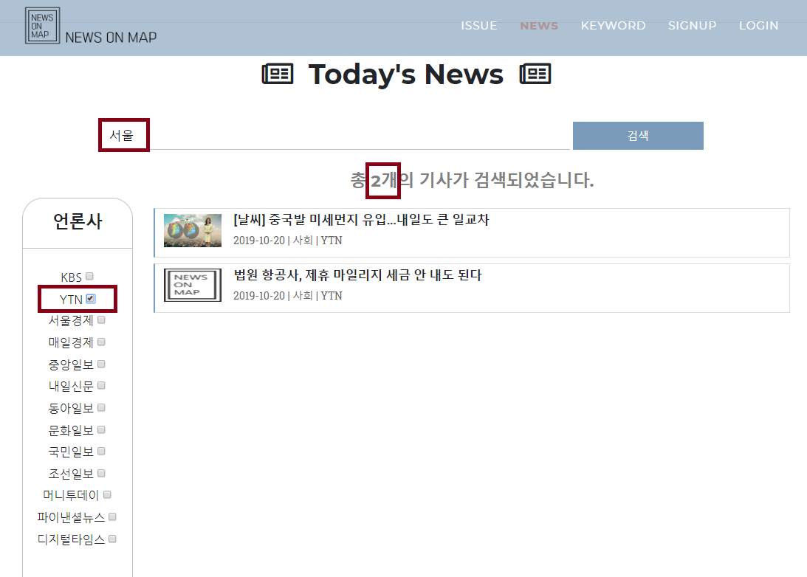

#  News On Map

## Table of Contents

- [About the Project](#about-the-project)
- [Features](#features)
- [Getting Started](#getting-started)
  - [Architecture](#architecture)
  - [Prerequisites](#prerequistites)
  - [Installation](#insatllation)
  - [Usage](#usage)
- [Flow Chart](#flow-chart)
- [Screen Configuration](#screen-configuration)
- [Contact](#contact)

## About the Project

- 키워드를 통한 뉴스정보를 한 눈에 파악하여 제공하는 빅데이터 분석을 통한 뉴스 사이트

## Features

- **지도를 통해 국내 지역별로 분류된 뉴스를 제공하는 서비스**
- 키워드 검색으로 관련 뉴스를 조회
- 카테고리 필터링을 통해 신문사, 카테고리별 뉴스 조회
- 키워드 빈도수를 시각화하여 워드클라우드로 금일의 이슈 파악

## Getting Started

### Architecture

- Client

  - HTML5 / CSS3 / JavaScript / Jquery
  - Bootstrap
  - Naver Open API(Map)
  - D3.js

- Server

  - Spring STS 3.9.9
  - Tomcat 9.0
  - Mybatis
  - JSP
  - AWS
  - R, Rserve, Rselenium

  

- Database

  - MariaDB-10.3.18

  

- Development Flatform

  - eclipse-jee-2018-12-R-win32-x86_64
  - Java(jdk1.8.0_211)
  - R Studio
  - Chrome
  - Git

### Prerequistites

- Must need configure.properties file

  ```properties
  # DB Configuration
  db.driver=org.mariadb.jdbc.Driver
  rdb.driver=jdbc:mysql://localhost:3306/(DatabaseName)
  
  db.url=jdbc:mariadb://localhost:3306/(DatabaseName)
  db.userName=(Database_UserName)
  db.password=(Database_UserPassword)
  
  # Naver API Key
  naver.ID=(Naver Cloud Platform Map API Key)
  
  # ETRI AI Open API Key
  etri.KEY=(공공인공지능 오픈API,Data 서비스 포털 API Key)
  
  # R Selenium IP
  selenium.ip=localhost
  selenium.port=Port_Num
  
  # R Serve URL
  r.url=(Url)/NewsBigdata/src/main/webapp/resources/r/bigkindsRJava.R
  
  wordclouds.url=(Url)/NewsBigdata/src/main/webapp/resources/r/wordclouds2.R
  
  mysql-connector.url=(Url)/NewsBigdata/src/main/webapp/resources/r/mysql-connector-java-5.1.40.jar
  
  # CSV File URL
  province.url=(Url)/NewsBigdata/src/main/webapp/resources/data/earthquake_response/province2019.csv
  sigungu.url=(Url)/NewsBigdata/src/main/webapp/resources/data/earthquake_response/sigungu2019.csv
  ```

- Rserve operation is required for word cloud operation

- Rserve and Resellenium manoeuvres are required to collect news articles

### Insatllation

1. Proejct [Clone]
2. Eclipse [Import] - [Project from Folder or Archive]
3. Select [Project Folder]
4. [Wait] for Completion and Installation
5. [Project Properties] - [Project Facet] - [Java 1.8]

### Usage

1. Home page function by default
2. News data collection is time-set in 30 minutes

## Flow Chart


## Screen Configuration

- **Section 1 - News Map**
  
  - Check the list of news related to the selected area
  - News output
  
  
  
- **Section 2 - Keyword Search and Category Filter**
  
  - Search by Keyword
  
    
  
  - Search Keywords and Apply Category Filtering
  
  
  
- **Seciont 3 - WorldCloud and Linear Trend Graph**	

## Contact

- Project Link: [News On Map](https://github.com/ysgo/NewsBigdata)

